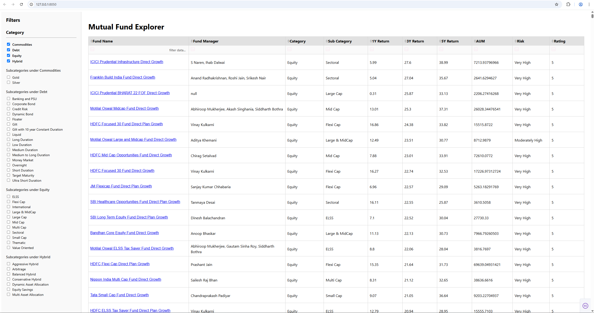

---

# 🧭 Mutual Fund Explorer

A lightweight interactive web dashboard built using Python and Dash that allows users to browse, filter, and explore mutual funds available on Groww. The app fetches real-time mutual fund data and provides category and sub-category filtering, sortable tables, and direct links to fund pages.

---

## 🚀 Features

- 🔍 **Filter by Category & Subcategory**  
- 📊 **View Fund Manager, Returns (1Y, 3Y, 5Y), AUM, Risk, and Rating**  
- 📎 **Clickable fund names linking to Groww**  
- 💡 **Real-time data fetched from Groww's API**  
- 📋 **Searchable and sortable data table**  

---

## 🛠️ Prerequisites

To run this project locally, ensure you have the following installed:

- **Python 3.7+**
- **pip** (Python package installer)

### Required Python packages:

You can install the dependencies using:

```bash
pip install -r requirements.txt
```

---

## ▶️ How to Run

1. **Clone the repository:**

```bash
git clone https://github.com/kedarnath93/groww-mf.git
cd groww-mf/dash/
```

2. **Install dependencies:**

```bash
pip install -r requirements.txt
```

> _Alternatively, install manually:_
> ```bash
> pip install dash pandas requests
> ```

3. **Run the application:**

```bash
python app.py
```

4. **Visit in your browser:**

Open [http://127.0.0.1:8050](http://127.0.0.1:8050) to interact with the dashboard.

App would look something like this:

---

## 📁 Project Structure

```bash
.
├── app.py              # Main application script
├── README.md           # Project overview and instructions
└── requirements.txt    # Dependency list (optional)
```

---

## 📌 Notes

- This dashboard is for **educational and informational purposes**.
- Data is fetched from a public endpoint provided by [Groww](https://groww.in).

---

## 🙌 Contributing

If you’d like to improve the functionality or add new features, feel free to fork the repo and submit a pull request.

---

## 📄 License

MIT License. See `LICENSE` for details.

---
